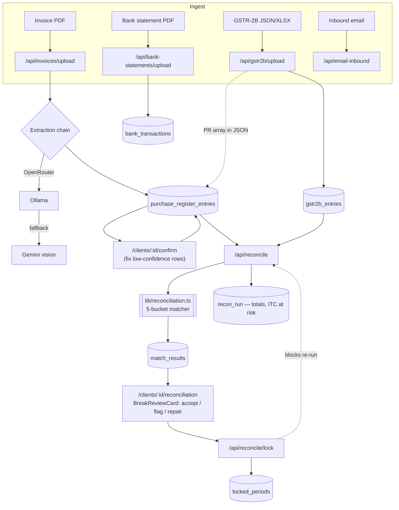

# GST Reconciliation Engine — Architecture

Multi-tenant tool for a CA firm to reconcile client **Purchase Register** against
**GSTR-2B** (what suppliers actually filed), classify every invoice into a
break bucket, review the breaks, and lock the period once filed.

## Stack

| Layer | Choice |
|---|---|
| App | Next.js 16 (App Router, React 19), Tailwind 4 |
| DB / Auth / Storage | Supabase (Postgres + RLS, `@supabase/ssr`) |
| Invoice extraction | OpenRouter → Ollama → Gemini vision fallback chain; `pdf-parse` + `pdfjs-dist` for text PDFs, regex parser (`parseText`) as last resort |
| GSTR-2B / PR import | `xlsx` + JSON parsers (portal `docdata.b2b` format and flat test format) |
| Bank statement extraction | `lib/bank-extractor.ts` (identify bank → adapter → narration parse → balance check) |
| Edge | `supabase/functions/extract-invoice` (async invoice extraction via Google Vision) |

## Data flow

## The 5-bucket matcher (`lib/reconciliation.ts`)

Match key: normalized supplier GSTIN + normalized invoice no (leading zeros
stripped, uppercased). Fuzzy fallback pass allows Levenshtein ≤ 2 on inv no for
OCR/typo tolerance.

| Bucket | Meaning |
|---|---|
| `MATCHED` | GSTIN + inv no align, all amounts within 5% tolerance |
| `PROBABLE` | Fuzzy inv-no match, amounts agree |
| `MISMATCH` | Keys match, one or more of taxable/CGST/SGST/IGST off by >5% |
| `BOOKS_ONLY` | In purchase register, not in GSTR-2B (supplier hasn't filed) |
| `TWOB_ONLY` | In GSTR-2B, not in books (unrecorded purchase) |

Each result carries `taxable_variance`, `tax_variance`, `itc_at_risk`, and an
`evidence` blob. Amount comparison is ratio-based (`amountDiff`) not float
equality, so rounding differences between accounting systems don't create false
breaks.

## Multi-tenancy

Every table is scoped by `org_id` (+ `client_id`). Supabase RLS enforces
isolation at the DB layer. `lib/db.ts#getDbAndOrg` resolves the caller's org
from `org_members`, or falls back to an admin client + `DEV_ORG_ID` when
unauthenticated (dev only).

Dedup: `purchase_register_entries` has a unique constraint on
`(org_id, file_hash)`.

## What's working now

- Client CRUD (`/api/clients`), org bootstrap (`/api/orgs`)
- Supabase auth login (`@supabase/auth-ui-react`) + SSR middleware session refresh
- **Invoice upload + extraction** — multi-provider chain with text-PDF fast path and vision fallback; date parser handles dd/mm/yyyy, `dd-Mon-yyyy`, ISO; refuses ambiguous layouts
- **GSTR-2B / purchase-register import** — portal JSON (`docdata.b2b`/`b2ba`), flat JSON, XLSX
- **Confirm flow** — low-confidence extracted rows flagged `needs_confirmation`; reconcile excludes them and reports the count
- **Reconcile run** — 5-bucket matcher, per-run totals, ITC-at-risk, `balances_off` flag when total tax variance > ₹100
- **Break review** — accept / flag / repair per break, bulk accept, audit-logged; review decisions carried forward across re-runs (re-import does *not* wipe them)
- **Period lock** — `/api/reconcile/lock` writes `locked_periods`; reconcile returns 409 on locked periods; GSTR-3B due date shown (20th of following month)
- Ageing view, data view, break explanation (`lib/explain-break.ts`)
- Bank statement extraction pipeline + upload API (schema + parser in place)

## In progress / rough edges

- Bank statement reconciliation (extraction done; matching to ledger not wired)
- `supabase/migrations/fix_schema_drift.sql` — `extraction_jobs` + `locked_periods` added out-of-band; needs folding into a clean migration history
- Inbound email → invoice route (`/api/email-inbound`) exists, routing table present, not end-to-end tested
- Extraction accuracy depends on provider env keys (`OPENROUTER_API_KEY` / `GEMINI_API_KEY`); no key ⇒ regex-only, low confidence
